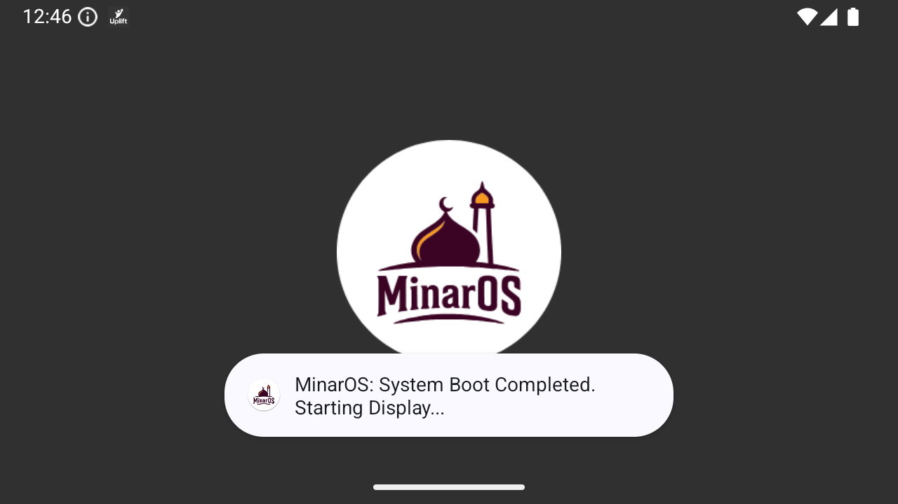
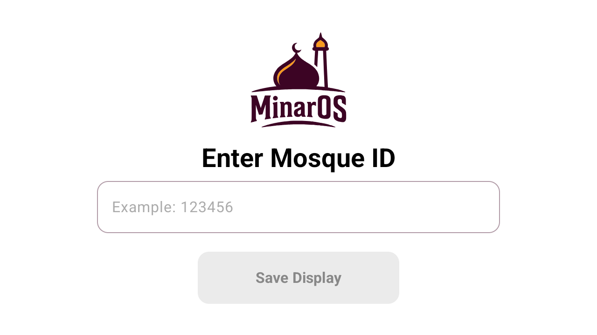
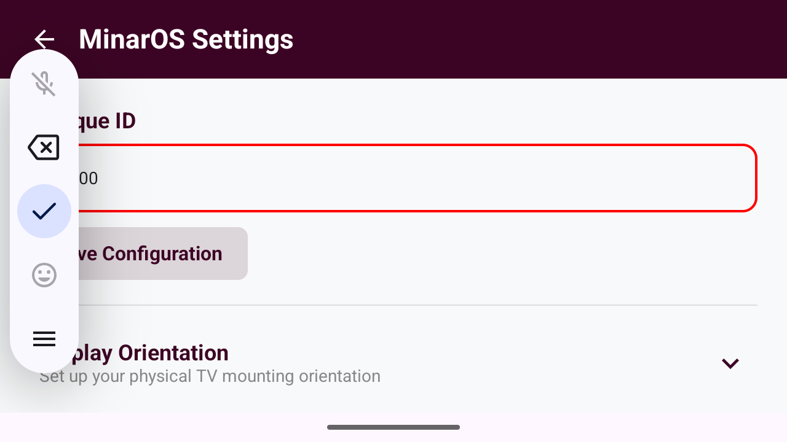
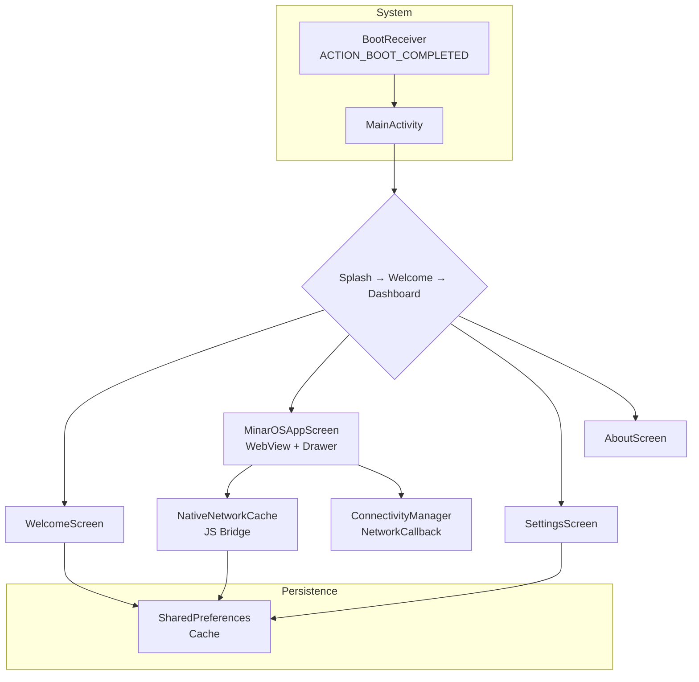

# MinarOS Screen

Android TV kiosk-mode digital signage for mosques. Loads the MinarOS mosque management dashboard in a fullscreen WebView with offline caching, boot auto-start, and TV remote/D-pad navigation.

## Badges

 &nbsp; 

## Screenshots

<!--
  TODO: Capture and place remaining screenshots in docs/screenshots/.
  Already captured:
    ✓ Splash screen                       -> docs/screenshots/splash.png
    ✓ Mosque ID entry (welcome) screen    -> docs/screenshots/welcome.png
    ✓ Dashboard WebView                   -> docs/screenshots/dashboard.png
  Still needed:
    ✗ Settings screen with drawer open   -> docs/screenshots/settings.png
    ✗ About screen                        -> docs/screenshots/about.png
-->

| Splash | Welcome | Dashboard | Settings | About |
|--------|---------|-----------|----------|-------|
|  |  |  |  |  |

## Features

- **Kiosk-mode WebView dashboard** — Loads `https://minaros.com/{mosqueId}` in a fullscreen, persistently cached WebView with JavaScript bridge for offline support.
- **Offline-first caching** — Custom `@JavascriptInterface` bridge intercepts `fetch()` and `XMLHttpRequest` responses; serves cached JSON when the device is offline.
- **Boot auto-start** — `BroadcastReceiver` launches the display immediately after device power-on (kiosk/dedicated-device scenario).
- **TV remote / D-pad navigation** — Full D-pad support with focus-aware composables, `FocusRequester` for auto-focus, and custom scroll interceptors.
- **Orientation control** — Landscape, portrait, and reverse portrait modes persisted in `SharedPreferences`.
- **Always-on display** — Configurable wakelock via `FLAG_KEEP_SCREEN_ON` toggle.
- **Network-aware reload** — Real-time `ConnectivityManager.NetworkCallback` automatically reloads the WebView when connectivity is restored.
- **Double-tap to exit** — Two back presses within 500 ms close the app.
- **Side navigation drawer** — Quick actions: Refresh, Settings, About, Exit.

## Tech Stack

| Layer | Technology |
|---|---|
| **Language** | Kotlin 2.0.21 |
| **UI Toolkit** | Jetpack Compose + AndroidX TV Compose (tv-foundation 1.0.0-alpha07, tv-material 1.0.0-alpha07) |
| **Navigation** | Navigation Compose 2.9.8 |
| **Activity** | Activity Compose 1.12.4 |
| **Lifecycle** | Lifecycle Runtime KTX 2.6.1 |
| **Material Design** | Material 3 (Compose 1.4.0) |
| **Build System** | Gradle 8.13 + Android Gradle Plugin 8.13.2 |
| **Min / Target SDK** | 23 / 36 |
| **JVM Target** | 11 |

## Architecture

The app follows a single-module, package-by-feature structure. The root `MainActivity` manages a 3-state animated state machine (`SPLASH → WELCOME → MAIN_DISPLAY`). Each screen lives in its own feature package and reads from a thin data layer backed by `SharedPreferences` and a persistent `WebView` with a JavaScript bridge.

```
User Input (touch / D-pad)
        │
        ▼
┌──────────────────┐
│  MainActivity     │  State machine with AnimatedContent
│  (NavHost)        │  SPLASH → WELCOME → MAIN_DISPLAY
└──────┬───────────┘
       │ navigate()
       ▼
┌─────────────────────────────────────────────────────┐
│  Screens                                            │
│  ┌──────────┐ ┌──────────┐ ┌──────────┐ ┌────────┐ │
│  │  Splash   │ │ Welcome  │ │Dashboard │ │Settings│ │
│  │          │ │(ID Entry)│ │ (WebView)│ │  About │ │
│  └──────────┘ └──────────┘ └──────────┘ └────────┘ │
└──────────────────────┬──────────────────────────────┘
                       │
                       ▼
┌───────────────────────────────────────────────────────┐
│  Data Layer                                            │
│  ┌──────────────────┐  ┌───────────────────────────┐  │
│  │ SharedPreferences │  │  WebView (persistent)     │  │
│  │ (MosqueDataMgr)   │  │  + JS Bridge             │  │
│  └──────────────────┘  │  (NativeNetworkCache)      │  │
│                        └───────────────────────────┘  │
│  ┌───────────────────────────────────────────────┐    │
│  │  ConnectivityManager.NetworkCallback            │    │
│  └───────────────────────────────────────────────┘    │
└───────────────────────────────────────────────────────┘
```



## Project Structure

```
app/
├── src/main/
│   ├── java/com/example/minaros/
│   │   ├── MainActivity.kt                  # Entry point & state machine
│   │   ├── bridge/
│   │   │   └── NativeNetworkCache.kt         # @JavascriptInterface for offline caching
│   │   ├── core/
│   │   │   └── NetworkUtils.kt               # Connectivity check utility
│   │   ├── data/
│   │   │   └── MosqueDataManager.kt          # SharedPreferences wrapper for Mosque ID
│   │   ├── receivers/
│   │   │   └── BootReceiver.kt               # Auto-start on device boot
│   │   └── ui/
│   │       ├── components/                   # Shared composables (TvButton, DrawerMenuItem)
│   │       ├── navigation/                   # NavHost with 3 routes
│   │       ├── screens/
│   │       │   ├── about/                    # Brand info, version, contact
│   │       │   ├── dashboard/                # WebView + drawer + orientation wrapper
│   │       │   ├── settings/                 # Settings sections
│   │       │   │   └── sections/             # Constraints, Rotation, Storage toggles
│   │       │   └── splash/                   # Animated splash + Mosque ID welcome
│   │       └── theme/                        # Color, Theme, Typography definitions
│   └── res/
├── build.gradle.kts                          # App module build config
├── proguard-rules.pro
└── .gitignore

gradle/
├── libs.versions.toml                        # Version catalog
└── wrapper/

build.gradle.kts                              # Root build file
settings.gradle.kts                           # Project settings (rootProject.name)
gradle.properties                             # JVM args, AndroidX flags
```

## Getting Started

### Prerequisites

- **Android Studio** Hedgehog (2023.1.1) or newer
- **JDK 17** (bundled with Android Studio)
- **Android SDK** platform 36 + compatible build-tools (AGP 8.13.2)

### Clone & Build

```bash
git clone https://github.com/your-org/minaros-screen.git
cd minaros-screen
```

Open in Android Studio and sync, or build from the command line:

```bash
# Debug APK
./gradlew assembleDebug
```

Output: `app/build/outputs/apk/debug/MinarOS.apk`

### Run on Device

1. Enable **Developer options** and **USB debugging** on your Android TV / tablet.
2. Connect via ADB or use Android Studio's device picker.
3. ```bash
   ./gradlew installDebug
   ```

### Configuration

- No API keys or external services required.
- On first launch, enter a Mosque ID — the dashboard loads from `https://minaros.com/{mosqueId}`.
- For boot auto-start, grant `RECEIVE_BOOT_COMPLETED` permission and enable the relevant device settings.

## Roadmap

- [ ] **System updates** — Settings "Check for Updates" button is a placeholder (always reports up-to-date).
- [ ] **Mosque ID reset** — No UI to change the ID without clearing app data.
- [ ] **Error handling** — Invalid Mosque IDs show a WebView error page instead of a user-friendly message.
- [ ] **Tests** — No unit or instrumentation tests exist.
- [ ] **CI/CD** — No automated build or test pipeline configured.
- [ ] **Package name** — Currently `com.example.minaros.screen`; should be changed to a production namespace before release.
- [ ] **Project name** — `settings.gradle.kts` uses `"Demo App"`; should be renamed to `"MinarOS Screen"`.

## License

No license has been selected yet. All rights reserved.
